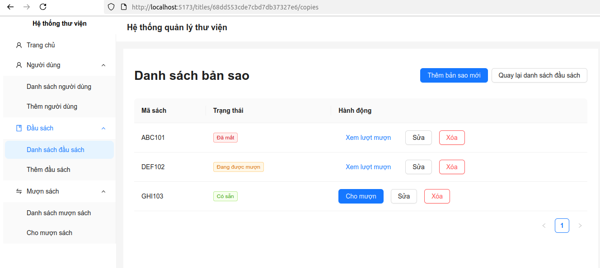
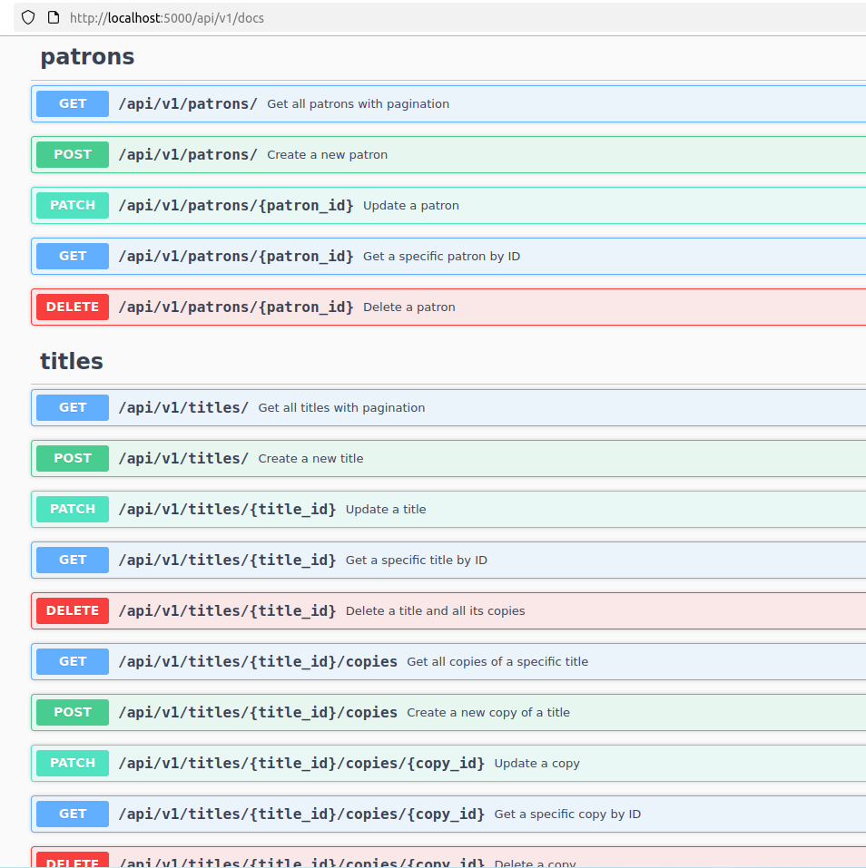
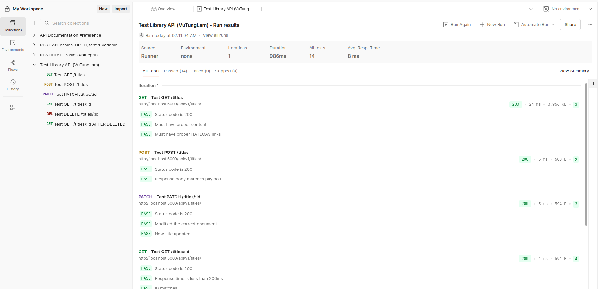
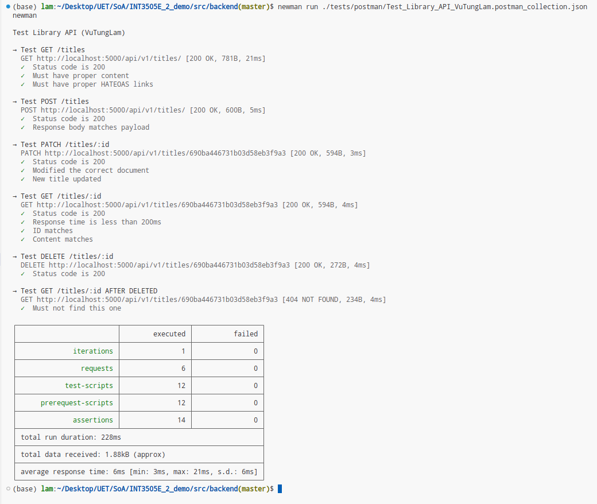
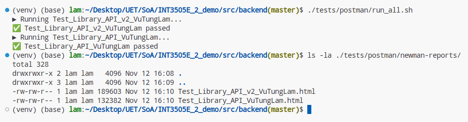
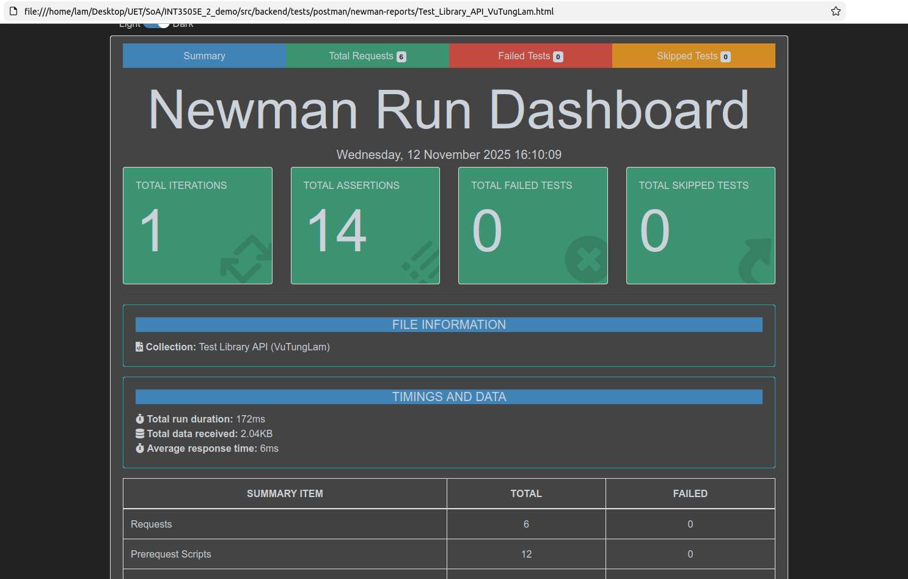
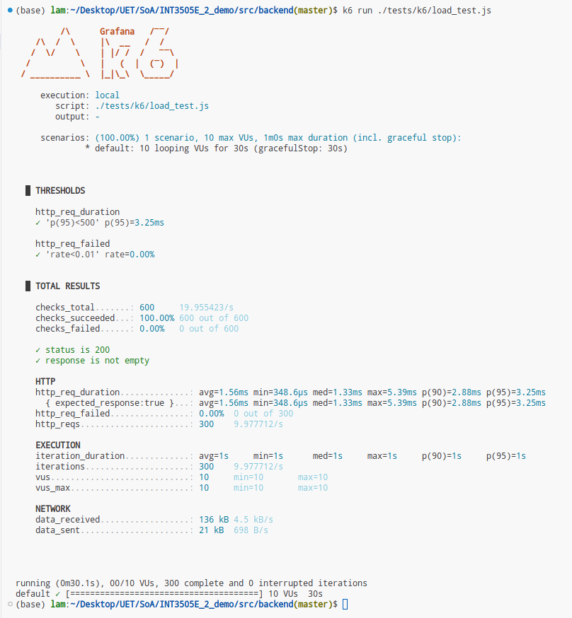

# INT3505E 2 Demo: Hệ thống thư viện đơn giản

- [INT3505E 2 Demo: Hệ thống thư viện đơn giản](#int3505e-2-demo-hệ-thống-thư-viện-đơn-giản)
  - [Thông tin chung](#thông-tin-chung)
  - [Tài liệu thiết kế](#tài-liệu-thiết-kế)
  - [Setup](#setup)
    - [Setup: Backend](#setup-backend)
    - [Setup: Frontend](#setup-frontend)
  - [Run](#run)
    - [Run: Backend](#run-backend)
    - [Run: Frontend](#run-frontend)
  - [Testing](#testing)
    - [Backend API Testing with Postman](#backend-api-testing-with-postman)
    - [Backend API Testing with Newman](#backend-api-testing-with-newman)
    - [Backend Load Testing with k6](#backend-load-testing-with-k6)
    - [Backend API Backward Compatibility Testing with oasdiff](#backend-api-backward-compatibility-testing-with-oasdiff)
    - [Backend API Contract Testing with Schemathesis](#backend-api-contract-testing-with-schemathesis)
  - [CI/CD](#cicd)





## Thông tin chung

- **Sinh viên:** Vũ Tùng Lâm 22028235 UET
- **Yêu cầu đề bài:**
  - Topic: hệ thống thư viện đơn giản bao gồm: quản lý sách, mượn - trả sách.
  - Sử dụng Flask
  - Assignment Link: <https://portal.uet.vnu.edu.vn/courses/3181/assignments/31620>

## Tài liệu thiết kế

- [Đặc tả yêu cầu](./docs/SRS/README.md)
- [Thiết kế hệ thống](./docs/SystemDesign/README.md)

## Setup

### Setup: Backend

Yêu cầu Python 3.12+,
MongoDB 8.0+ (các phiên
bản cũ hơn có thể vẫn
chạy được, nhưng chưa được
kiểm chứng.)

```sh
cd <project_root>
cd src/backend

virtualenv venv -p $(which python3.12)
source ./venv/bin/activate
pip install -r requirements.txt
```

Đồng thời trong thư mục `src/backend`,
copy file `.env.example` vào file mới
tên là `.env`. Sửa các biến môi trường
trong file đó cho phù hợp.

### Setup: Frontend

Yêu cầu Node.js 22+ (các phiên
bản cũ hơn có thể vẫn
chạy được, nhưng chưa được
kiểm chứng.)

```sh
cd <project_root>
cd src/frontend

yarn
```

## Run

### Run: Backend

```sh
cd <project_root>
cd src/backend
source ./venv/bin/activate

flask run --host=0.0.0.0 --port=5000
```

### Run: Frontend

Sau khi chạy backend, cần tạo lại
OpenAPI contracts:

```sh
cd <project_root>
cd src/frontend

yarn api:sync
```

Từ đó về sau, nếu backend không có
thay đổi về API, có thể chạy frontend
như thông thường:

```sh
cd <project_root>
cd src/frontend

yarn dev
# OR:
yarn build
yarn preview
```

## Testing

### Backend API Testing with Postman

Import any JSON file under `<project_root>/src/backend/tests/postman/`
into Postman as a Collection, then run it.



### Backend API Testing with Newman

First, install Newman and its HTML reporter (exporter)

```sh
npm install -g newman newman-reporter-htmlextra
```

You could run each test manually:

```sh
cd <project_root>
cd src/backend

newman run ./tests/postman/Test_Library_API_v2_VuTungLam.postman_collection.json
```



or you could run all tests AND export
the results in HTML, which will be
available under
`<project_root>/src/backend/tests/postman/newman-reports`:

```sh
cd <project_root>
cd src/backend

./tests/postman/run_all.sh
```





### Backend Load Testing with k6

First, [install k6](https://grafana.com/docs/k6/latest/set-up/install-k6).

Then, run the tests:

```sh
cd <project_root>
cd src/backend

k6 run ./tests/k6/load_test.js
```

Result:



### Backend API Backward Compatibility Testing with oasdiff

First, install `oasdiff`:

```sh
curl -fsSL https://raw.githubusercontent.com/oasdiff/oasdiff/main/install.sh | sudo sh
```

(I've tested with version 1.11.7 ; the above command installs the latest.)

Then, run this to make sure API v3 is backward-compatible
with API v2:

```sh
OLD_SPEC="http://localhost:5000/api/v2/swagger.json"
NEW_SPEC="http://localhost:5000/api/v3/swagger.json"

oasdiff changelog --fail-on ERR "$OLD_SPEC" "$NEW_SPEC"
```

which would fail (nonzero exit code) if there are any
*breaking changes*.

### Backend API Contract Testing with Schemathesis

First, install Specmatic (could be in any
Python environment):

```sh
pip install schemathesis requests
```

(I've tested with version 4.5.0 ; the above command installs the latest.)

Then, run it against API v3, for example:

```sh
NEW_SPEC="http://localhost:5000/api/v3/swagger.json"

schemathesis run "$NEW_SPEC" --checks=content_type_conformance --max-examples=3 --phases=examples
```

The above command would only check for `Content-Type`
conformance of the API under test. Customize the
flags per Schemathesis' official documentation for
desired tests.

## CI/CD

This project's GitHub Actions workflow run the following tests:

- 1. [Backend API Testing with Newman](#backend-api-testing-with-newman)
- 2. [Backend Load Testing with k6](#backend-load-testing-with-k6)
- 3. [Backend API Backward Compatibility Testing with oasdiff (API v3-v2)](#backend-api-backward-compatibility-testing-with-oasdiff)

To run the workflow locally for debugging purpose, install
[`nektos act`](https://nektosact.com/installation/index.html),
then run:

```sh
cd <project_root>

act
```
