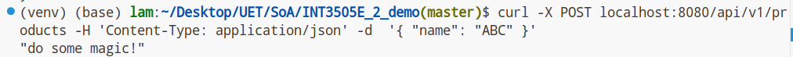

# Buổi 7: Nguyên lý Triển khai Backend Service

- [Buổi 7: Nguyên lý Triển khai Backend Service](#buổi-7-nguyên-lý-triển-khai-backend-service)
  - [Đề bài](#đề-bài)
  - [Demo](#demo)
    - [Viết file oas.yaml](#viết-file-oasyaml)
    - [Sinh code backend từ oas.yaml](#sinh-code-backend-từ-oasyaml)
    - [Setup, chạy và cập nhật backend code](#setup-chạy-và-cập-nhật-backend-code)

## Đề bài

- **Kiến thức cần đạt:**

    Sử dụng OpenAPI để sinh code backend (Swagger Codegen)
    Kết nối API với database (MongoDB/Mongoose)

- **Kỹ năng cần làm được:**

    Triển khai backend từ OpenAPI spec
    Tích hợp với database để lưu trữ dữ liệu

- **Thực hành:**

    Cài đặt backend từ file OpenAPI có sẵn
    Tạo CRUD operations cho resource "Product"

## Demo

### Viết file oas.yaml

File định nghĩa một API gồm

- 2 endpoints tạo và lấy danh sách
    các users.

- 2 endpoints tạo và lấy danh sách
    các Products.

### Sinh code backend từ oas.yaml

- Cài đặt tool:
    
    ```sh
    npm install -g @openapitools/openapi-generator-cli
    ```

- Tạo Python (Flask) server stub code:
    
    ```sh
    cd <project_root>
    cd src/oas_gen_demo

    openapi-generator-cli generate \
        -i oas.yaml \
        -g python-flask \
        -o generated-server
    ```

### Setup, chạy và cập nhật backend code

- Setup:

    ```sh
    cd <project_root>
    cd src/oas_gen_demo

    cd generated-server
    virtualenv venv
    source ./venv/bin/activate
    pip install -r requirements.txt
    ```

- Run server:
    
    ```sh
    cd <project_root>
    cd src/oas_gen_demo
    cd generated-server
    source ./venv/bin/activate

    python -m openapi_server
    ```

- Dùng thử API:

    

    

    

    

    

    

- Cập nhật code khi thay đổi `oas.yaml`:
    
    ```sh
    cd <project_root>
    cd src/oas_gen_demo

    openapi-generator-cli generate \
        -i oas.yaml \
        -g python-flask \
        -o generated-server \
        --skip-validate-spec
    ```

    Thêm flag `--skip-overwrite` nếu muốn giữ
    các file đã được sửa thủ công (đã thay đổi
    từ lần gen tự động trước đó).
